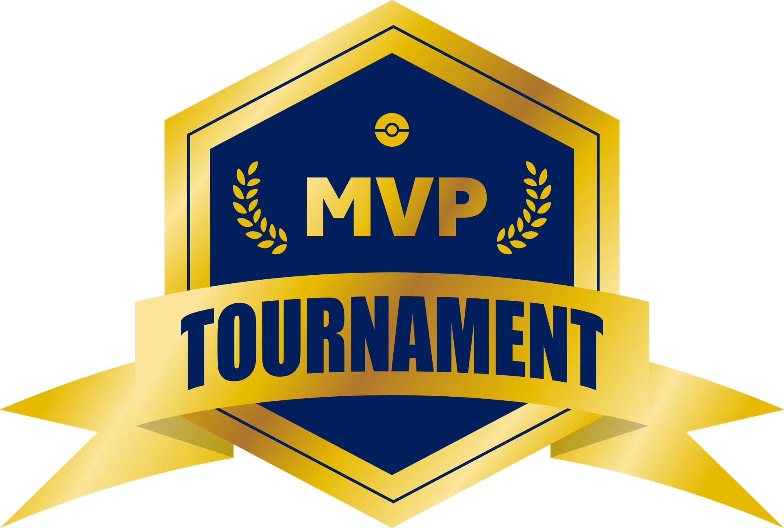

🌐 Available in:

# **Pokémon MVP Tournament**

_August 2025, My coded universe_ :sparkles:

### **About the project** :trophy:

***
Pokémon MVP Tournament (or PMT for friends) is an Android application in development which simulates a fictional competitive tournament. It was born as a personal project as a result of the creation, expression and passion for the entertainment, where I combine my learning about Multiplatform Applications Development with a simulated tournament: _Pokémon_ is the content, , _RuPaul's Drag Race_ gave me the form and _this app_ is the way.

### **About the app** :iphone:

***

The PMT app pretends to keep the users up to date about the tournament news, and make them take part in the decision makings about the future of this universe:

 
| Information :information_source: | Inclusion :raising_hand: |
|-------------|-----------|
|Contestants/Challenges per season|Voting for their favorite|
|Challenges results|Casting of future contestants|
|Contestants’ progression|Contestants’ performance judging|
|Final ranking|Community creation|

### **Technology** :computer:

 ***

Frontend:
 

 

Backend:
🚧 Under construction 🚧
 

### **Next steps** :paw_prints:

***
Although the app is in development, take a look at the checklist to know which are the next steps:

##### _Frontend: visible functionalities_
- [ ] Login validation and Register new user screen
- [ ] First season information screen
- [ ] User screen with user personal data and acces to tournament polls

##### _Backend: API and persistence_
🚧 Under construction 🚧

### **Inspiration and Motivation** :sparkles:

***

As a highly creative person, I find in entertainment my main way of expression, individual and artistically, and in competition a stage for showing my abilities.
That is why this project let me mix the logic in the software development with the emotion of the competitive tournaments, with the aim of the user, not only seeing the data, but also living the whole experience of a competitive reality.

